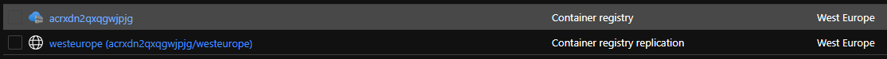

# Module: Azure Container Registry with diagnostics logs to Log Analytics workspace and policies

This module creates an Azure Container Registry with diagnostics logs, sends them to a Log Analytics workspace and with policies. 

You can optionally configure both system and user-assigned managed identity, admin user, public access, IP rules, virtual network rules (used in combination with service endpoints), zone redundancy, policies, service tier, diagnostics, and resource lock.

Module deploys the following resources:

- Azure Container Registry
- Diagnostics
- Resource Lock

## Parameters

The module requires the following inputs:

 | Parameter                     | Type   | Default                                                                                                                             | Description                                                                                                                                                                                                                                                                                                                                                                                                                               | Requirement                   | Example                      |
 | ----------------------------- | ------ | ---------------------------------------------------------------------------------------------------- | ----------------------------------------------------------------------------------------------------------------------------------------------------------------------------------------------------------------------------------------------------------------------------------------------------------------------------------------------------------------------------------------------------------------------------------------- | ----------------------------- | ---------------------------- |
 | parAcrName                  | string | acr${uniqueString(resourceGroup().id)}                                                                                                | Name of Azure Container Registry to deploy | 5-50 char | acrxdn2qxqgwjpjg
 | parLocation                 | string | resourceGroup().location                                                                                                              | Location where Azure Container Registry will be deployed | Valid Azure Region | westeurope
 | parDateModified             | string | utcNow('d')                                                                                                                           | Tag to be applied to resource when deployed | None | See Default
 | parResourceTags             | object | Empty Object {}, see example parameters file [`containerRegistry.parameters.example.json`](containerRegistry.parameters.example.json) | Tags to be applied to resource when deployed. If parResourceTags is not desired as an empty object, it should be used as the input parameter in the parameter file, i.e "parResourceTags": {"value": {} }''' | None | See Default
 | parAcrSku                   | string | Premium                                                                                                                               | Azure Container Registry service tier | Basic or Standard or Premium | Premium
 | parEnableSystemIdentity     | bool   | true                                                                                                                                  | Enable system-assigned managed identity | None | true
 | parUserAssignedIdentities   | object | Empty Object {}, recommended as empty, module will create system-assigned managed identity                                            | The list of user-assigned managed identity resource ids to associate with the Azure Container Registry. If parUserAssignedIdentities is not desired as an empty object, it should be used as the input parameter in the parameter file, i.e "parUserAssignedIdentities ": {"value": {} }''' | None | See Default
 | parEnableAdminUser          | bool   | false                                                                                                                                 | Enable admin user on Azure Container Registry | None | false
 | parPublicNetworkAccess      | string | Enabled                                                                                                                               | Enable public network access | Disabled or Enabled | Enabled
 | parZoneRedudancy            | string | Disabled                                                                                                                              | Zone redundancy, Azure Container Registry is minimum replicated across three seperate zones | Disabled or Enabled | Disabled
 | parNetworkRuleSet           | object | Empty Object {}, see example parameters file [`containerRegistry.parameters.example.json`](containerRegistry.parameters.example.json) | The network rule set for a container registry. If parNetworkRuleSet is not desired as an empty object, it should be used as the input parameter in the parameter file, i.e "parNetworkRuleSet": {"value": {} }''' | None | See Default
 | parNetworkRuleByPassOptions | string | None                                                                                                                                  | Allow trusted Azure services to access restricted registry | AzureServices or None | None
 | parPolicies                 | object | Empty Object {}, see example parameters file [`containerRegistry.parameters.example.json`](containerRegistry.parameters.example.json) | Azure Container Registry policies. If parPolicies is not desired as an empty object, it should be used as the input parameter in the parameter file, i.e "parPolicies": {"value": {} }''' | None | See Default
 | parEnableDiagnostics        | bool   | true                                                                                                                                  | Diagnostic logs | None | true
 | parLogAnalyticsWorkspaceId  | string | Empty String '', see example parameters file [`containerRegistry.parameters.example.json`](containerRegistry.parameters.example.json) | Log analytics workspace resource id. Only required if parEnableDiagnostics is set to true. If parLogAnalyticsWorkspaceId is not desired as an empty string, it should be used as the input parameter in the parameter file, i.e "parLogAnalyticsWorkspaceId": {"value": {} }''' | None | See Default
 | parEnableDeleteLock         | bool   | true                                                                                                                                  | Delete lock | None | true
 
## Outputs

The module will generate the following outputs:

| Output                               | Type   | Example                                                                                                                                                |
| -------------------------            | ------ | ------------------------------------------------------------------------------------------------------------------------------------------------------ |
| outAzureContainerRegistryName        | string | acrxdn2qxqgwjpjg                                                                                                                                       |
| outAzureContainerRegistryId          | string | /subscriptions/427f6415-fa22-44d4-b682-93c4d0274884/resourceGroups/MyContainerReg-RG/providers/Microsoft.ContainerRegistry/registries/acrxdn2qxqgwjpjg |
| outAzureContainerRegistryLoginServer | string | acrxdn2qxqgwjpjg.azurecr.io                                                                                                                            |

## Deployment
> **Note:** `bicepconfig.json` file is included in the module directory. This file allows us to override the Bicep linter.

In this example, the Azure Container Registry will be deployed to the resource group specified.

 | Azure Cloud    | Bicep template          | Input parameters file                     |
 | -------------- | ----------------------- | ----------------------------------------- |
 | Global regions | containerRegistry.bicep | containerRegistry.parameters.example.json |

> For the below examples, assumption is that you have downloaded or cloned the Git repo as-is and are in the root of the repository as your selected directory in your terminal of choice.

### Azure CLI

```bash
# For Azure global regions
# Set container registry subscription ID as the current subscription 
ContainerRegistrySubscriptionId = "[your subscription ID]"
az account set --subscription $ContainerRegistrySubscriptionId

az group create --location westeurope \
   --name MyContainerReg-RG

az deployment group create \
   --resource-group MyContainerReg-RG \
   --template-file modules/microsoft.containerregistry/container-registry-with-diagnostics-log-analytics-and-policy/containerRegistry.bicep \
   --parameters @modules/microsoft.containerregistry/container-registry-with-diagnostics-log-analytics-and-policy/containerRegistry.parameters.example.json  
```

### PowerShell

```powershell
# For Azure global regions
# Set container registry subscription ID as the current subscription 
ContainerRegistrySubscriptionId = "[your subscription ID]"
Select-AzSubscription -SubscriptionId $ContainerRegistrySubscriptionId

New-AzResourceGroup -Name 'MyContainerReg-RG' `
  -Location 'westeurope'
  
New-AzResourceGroupDeployment `
  -ResourceGroupName 'MyContainerReg-RG' `
  -TemplateFile modules/microsoft.containerregistry/container-registry-with-diagnostics-log-analytics-and-policy/containerRegistry.bicep `
  -TemplateParameterFile modules/microsoft.containerregistry/container-registry-with-diagnostics-log-analytics-and-policy/containerRegistry.parameters.example.json
```

## Example Output in Azure global regions



## Bicep Visualizer

